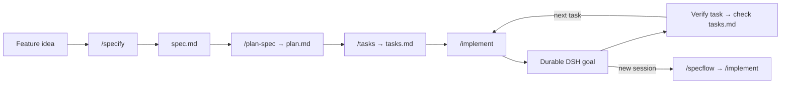

# dsh-specflow

<p align="center">
  
</p>

[](https://github.com/lonelymoon87/dsh-specflow/actions/workflows/ci.yml)
[](https://github.com/lonelymoon87/dsh-specflow/actions/workflows/dsh-compatibility.yml)
[](https://www.npmjs.com/package/dsh-specflow)
[](https://github.com/lonelymoon87/dsh-specflow/releases/latest)
[](./LICENSE)

Turn an idea into a reviewable specification, implementation plan, task list, and resumable [DeepSeek Harness](https://github.com/deepseek-ai/deepseek-harness) goal.

SpecFlow stores the work in the repository instead of one conversation. A later session can read the same artifacts, recover the next unchecked task, and resume the matching durable DSH goal.

The v0.1.4 release is live on npm and tested with DSH 0.1.0-rc.8 and 0.1.1-rc.1 while retaining the rc.6-compatible peer range.

[简体中文](./README.zh-CN.md)

## Quick start

```sh
dsh plugin --profile web add dsh-specflow
dsh web
```

In a DSH session, enter `/specflow` to see the workflow. A complete run uses these commands:

```text
/constitution Require focused tests for every behavior change
/specify Add resumable exports to the CLI
/plan-spec 001-resumable-exports
/tasks 001-resumable-exports
/implement 001-resumable-exports
```

After a restart or a new session, recover the durable state without reconstructing the conversation:

```text
/specflow 001-resumable-exports
/implement 001-resumable-exports
```



See [`examples/001-resumable-export`](./examples/001-resumable-export/) for a complete artifact set paused at 2/4 tasks.

## Why SpecFlow

SpecFlow keeps requirements, design decisions, and task progress in reviewable workspace files instead of relying on one chat's memory. A durable DSH goal represents the whole specification, while `tasks.md` remains the authoritative record for individual work items.

SpecFlow provides:

- five portable skills: `constitution`, `specify`, `plan-spec`, `tasks`, and `implement`;
- six discoverable UI commands: `/specflow`, `/constitution`, `/specify`, `/plan-spec`, `/tasks`, and `/implement`;
- a `specflow_status` tool that reads checkbox progress from `tasks.md`;
- goal creation and explicit resume for `/implement`;
- active goal and task progress in DSH runtime context;
- templates for `spec.md`, `plan.md`, and `tasks.md`.

## Artifact protocol

```text
.dsh/
├── memory/
│   └── constitution.md
└── specs/
    └── 001-example-feature/
        ├── spec.md
        ├── plan.md
        └── tasks.md
```

The spec directory is the durable source of truth. SpecFlow does not add a required custom session event or maintain a second hidden task database.

## Permissions and data

- SpecFlow reads `tasks.md` through the mounted DSH filesystem service. Its skills may ask the agent to create or update files under `.dsh/memory/` and `.dsh/specs/` through the profile's normal tool and approval policy.
- When `autoInjectContext` is enabled, the active goal and the most recently observed task counts become model-visible runtime context.
- The plugin does not make network requests, resolve credentials, transmit telemetry, or register a custom durable session event.

## Install

The package supports the DSH `>=0.1.0-rc.6 <0.2.0` plugin APIs and Node.js `^22.19 || >=24`.

```sh
dsh plugin --profile web add dsh-specflow
```

To pin the current release or install without npm resolution, use the prebuilt GitHub Release tarball:

```sh
dsh plugin --profile web add https://github.com/lonelymoon87/dsh-specflow/releases/download/v0.1.4/dsh-specflow-0.1.4.tgz
```

The release tarball needs no build allowance. A pinned source install is also supported:

```sh
dsh plugin --profile web add github:lonelymoon87/dsh-specflow#v0.1.4
```

The source install runs this package's `prepare` build. pnpm 10 and later reject it until the profile allowlists the exact package key printed by the failed command; apply that instruction and rerun the same `dsh plugin add` command. Replace `web` with `headless` to install into the one-shot agent profile.

To upgrade, rerun `dsh plugin add` with the newer release URL. To uninstall:

```sh
dsh plugin --profile web remove dsh-specflow
```

After installation, start DSH with the same profile and use:

```text
/specflow
/constitution Require focused tests for every behavior change
/specify Add resumable exports to the CLI
/plan-spec 001-resumable-exports
/tasks 001-resumable-exports
/implement 001-resumable-exports
```

`/specflow <NNN-slug>` reports the durable checkbox progress, next task, artifact path, and exact resume command. The same status is available to the agent through `specflow_status`.

## Configuration

The bundle inserts the plugin with defaults. A profile may configure the plugin entry directly:

```yaml
- id: specflow
  name: dsh-specflow
  config:
    specsDir: .dsh/specs
    autoInjectContext: true
```

`specsDir` may be workspace-relative or absolute. `autoInjectContext` controls only the model-facing progress snapshot; it does not change goal or artifact behavior.

## Design constraints

- Exports are named only; no default export is mixed into the Loader module.
- All registry contributions use the owning DSH service's effect-backed `register()` method.
- Commands enqueue an explicit user skill invocation so the skill loader remains the single owner of method instructions.
- `/implement` refuses to replace an unrelated active goal.
- Task completion is counted only from Markdown checkbox lines.

## Release evidence

- The v0.1.4 tarball installs directly from its HTTPS release URL into clean DSH 0.1.0-rc.8 and 0.1.1-rc.1 profiles.
- The same prebuilt package is published as [`dsh-specflow`](https://www.npmjs.com/package/dsh-specflow) and installs through the public npm registry.
- The packed bundle and pinned GitHub source install both appear in `dsh --dump-config`.
- CI covers Node 22.19 and Node 24; a compatibility matrix repeats the real install against DSH 0.1.0-rc.8 plus the `latest` and `next` npm tags.
- Bugs and compatibility reports are tracked in [GitHub Issues](https://github.com/lonelymoon87/dsh-specflow/issues).

## License

[MIT](./LICENSE)
