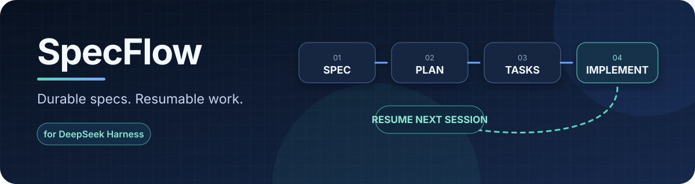
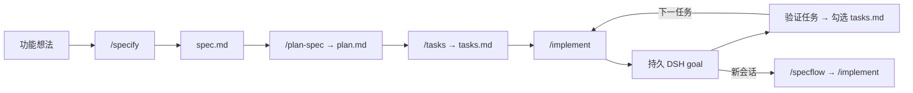

# dsh-specflow

<p align="center">
  
</p>

[](https://github.com/lonelymoon87/dsh-specflow/actions/workflows/ci.yml)
[](https://github.com/lonelymoon87/dsh-specflow/actions/workflows/dsh-compatibility.yml)
[](https://www.npmjs.com/package/dsh-specflow)
[](https://github.com/lonelymoon87/dsh-specflow/releases/latest)
[](./LICENSE)

把一个想法变成可审查的需求规格、实施方案、任务清单，以及可以跨会话恢复的 [DeepSeek Harness](https://github.com/deepseek-ai/deepseek-harness) goal。

SpecFlow 把工作状态写进仓库，而不是留在某一次对话里。新会话能够重新读取同一组文件，找到下一项未完成任务，并恢复对应的持久 goal。

v0.1.4 已发布至 npm，并针对 DSH 0.1.0-rc.8 与 0.1.1-rc.1 完成验证，同时保留兼容 rc.6 的 peer 范围。

[English](./README.md)

## 一分钟开始

```sh
dsh plugin --profile web add dsh-specflow
dsh web
```

进入 DSH 会话后，先输入 `/specflow` 查看完整流程。一轮标准使用依次执行

```text
/constitution 每一项行为改动都必须有聚焦测试
/specify 给 CLI 增加可恢复的导出任务
/plan-spec 001-resumable-exports
/tasks 001-resumable-exports
/implement 001-resumable-exports
```

进程重启或切换到新会话后，不用回忆上一段对话，直接读取持久状态并继续

```text
/specflow 001-resumable-exports
/implement 001-resumable-exports
```



[`examples/001-resumable-export`](./examples/001-resumable-export/) 提供一套停在 2/4 进度的完整示例文件，可以直接查看断线续跑时保存了什么。

## 它解决什么问题

SpecFlow 把需求、技术方案和任务进度写入可审查的工作区文件，不依赖某一次对话的记忆。一个持久 goal 对应整份规格，单项任务进度始终以 `tasks.md` 为准。

SpecFlow 包含以下能力。

- 5 个可移植技能，包括 `constitution`、`specify`、`plan-spec`、`tasks` 和 `implement`；
- 6 个可在 UI 发现的命令，包括 `/specflow`、`/constitution`、`/specify`、`/plan-spec`、`/tasks` 和 `/implement`；
- 从 `tasks.md` 读取复选框进度的 `specflow_status` 工具；
- `/implement` 阶段的 goal 创建和显式恢复；
- 注入 DSH runtime context 的当前目标与任务进度；
- `spec.md`、`plan.md`、`tasks.md` 模板。

## 文件协议

```text
.dsh/
├── memory/
│   └── constitution.md
└── specs/
    └── 001-example-feature/
        ├── spec.md
        ├── plan.md
        └── tasks.md
```

规格目录是持久状态的唯一事实源。插件不另外维护隐藏的任务数据库，也不为保存任务状态增加必需的自定义会话事件。

## 权限与数据

- SpecFlow 通过 DSH filesystem service 读取 `tasks.md`。各技能可能要求 Agent 经由当前 profile 的正常工具与审批策略，在 `.dsh/memory/` 和 `.dsh/specs/` 下创建或更新文件。
- 开启 `autoInjectContext` 后，当前 goal 与最近一次读取的任务计数会进入模型可见的 runtime context。
- 插件不发起网络请求，不读取凭据，不发送遥测，也不注册自定义持久会话事件。

## 安装

当前代码支持 DSH `>=0.1.0-rc.6 <0.2.0` 插件 API，要求 Node.js `^22.19 || >=24`。

```sh
dsh plugin --profile web add dsh-specflow
```

需要固定当前版本，或者不通过 npm 解析时，可以安装预构建的 GitHub Release tarball。

```sh
dsh plugin --profile web add https://github.com/lonelymoon87/dsh-specflow/releases/download/v0.1.4/dsh-specflow-0.1.4.tgz
```

Release tarball 不需要构建权限。也可以固定版本从源码安装。

```sh
dsh plugin --profile web add github:lonelymoon87/dsh-specflow#v0.1.4
```

源码安装会运行本包的 `prepare` 构建。pnpm 10 及以上版本默认拒绝执行，第一次安装失败时请按 DSH 输出的提示，将准确的包键加入 profile 的构建白名单，然后重新执行同一条命令。需要装进一次性 Agent profile 时，把命令中的 `web` 换成 `headless`。

升级时用新版本的 Release URL 再执行一次 `dsh plugin add`。卸载时执行

```sh
dsh plugin --profile web remove dsh-specflow
```

安装后，用同一 profile 启动 DSH，再依次执行

```text
/specflow
/constitution 每一项行为改动都必须有聚焦测试
/specify 给 CLI 增加可恢复的导出任务
/plan-spec 001-resumable-exports
/tasks 001-resumable-exports
/implement 001-resumable-exports
```

`/specflow <NNN-slug>` 会直接显示持久任务进度、下一项任务、文件位置和准确的恢复命令。Agent 也可以通过 `specflow_status` 读取同一份状态。

## 配置

```yaml
- id: specflow
  name: dsh-specflow
  config:
    specsDir: .dsh/specs
    autoInjectContext: true
```

`specsDir` 可以是工作区相对路径或绝对路径。`autoInjectContext` 只控制模型可见的进度快照，不改变 goal 和文件工件的行为。

## 发布验证

- v0.1.4 tarball 已从 HTTPS Release URL 直接安装进全新的 DSH 0.1.0-rc.8 与 0.1.1-rc.1 profile；
- 同一份预构建包已经作为 [`dsh-specflow`](https://www.npmjs.com/package/dsh-specflow) 发布，并通过公开 npm registry 完成安装验证；
- pack 产物与固定版本 GitHub 源码安装均通过 `dsh --dump-config` 检查；
- CI 覆盖 Node 22.19 与 Node 24，兼容矩阵会分别使用 DSH 0.1.0-rc.8、npm `latest` 与 `next` 标签重跑真实安装；
- bug 与兼容性问题统一进入 [GitHub Issues](https://github.com/lonelymoon87/dsh-specflow/issues)。

## 许可证

[MIT](./LICENSE)
